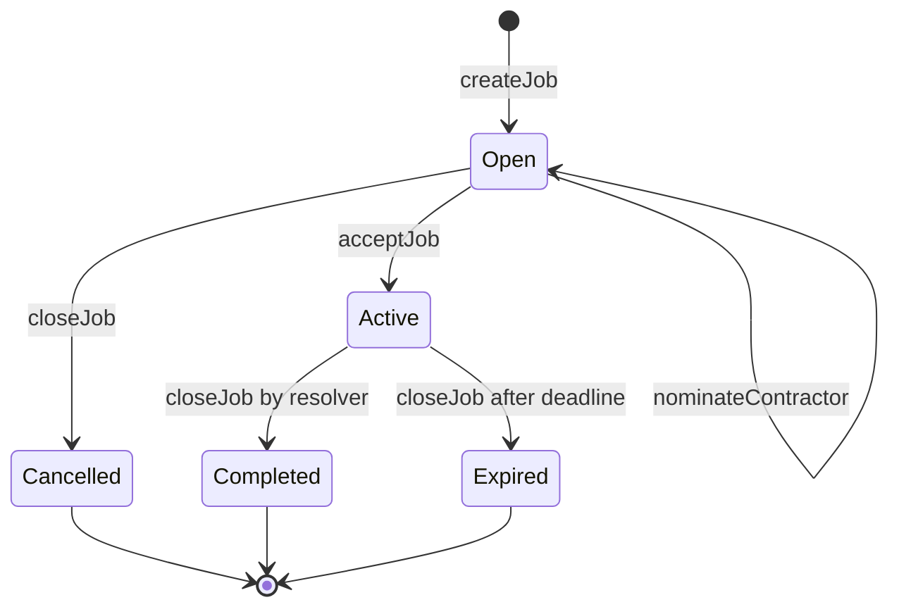

# ReputePay: an escrow payment system that is powered by reputation

## Summary

ReputePay is an escrow payment system that connects clients and contractors. It is built for the
World ID and ENS tracks of ETH Global Tokyo 2026 ([prizes](https://ethglobal.com/events/tokyo2026/prizes)).

- **Clients are human-verified.** A client must prove they are a unique human with World ID before
  registering. Uniqueness means a client cannot register again under a different wallet, so a
  banned client cannot start over.
- **Nominated contractors are paid upfront.** When a client explicitly nominates a contractor, the
  payment is pulled into escrow the moment the contractor accepts the job. The contractor knows
  the money is there before starting work.
- **Open-market contractors are protected by the client's stake.** If a client does not nominate
  anyone, any contractor can accept the job, and nothing is escrowed. The client's registration stake
  backs the payment: if the client cannot pay on completion, the stake is slashed and sent to the
  contractor, and the client is banned.
- **Reputation is updated when a job closes.** The escrow contract can immediately affect a
  client's standing, depending on whether the payment went through or the client was slashed.
  Optionally, the client can rate the contractor after the work is done.
- **ENS stores the reputation.** Clients and contractors get ENS subnames that hold their job
  history and ratings. This part is designed but not built yet; see
  [Limitations and Future Work](#limitations-and-future-work).

## Job Lifecycle

### Roles

| Role | Description |
|---|---|
| Client | Registers with a stake, creates jobs, and pays for them. Human-verified (World ID). |
| Contractor | Accepts and completes a job. Nominated by the client, or anyone on the open market. |
| Job resolver | An address the client picks per job. It decides whether the work was completed by calling `closeJob`. |
| Protocol owner | Sets the protocol fee (at most 10%) and the supported assets, and withdraws accrued fees. Cannot touch stakes or escrow. |

### States

### Steps

1. **Register.** The client calls `registerAndStake(asset, data)` and stakes the required amount of
   a supported asset. Banned addresses are rejected. `data` is reserved for the World ID proof.
2. **Create a job.** The client calls `createJob(jobHash, asset, amount, duration, resolver)`.
   `jobHash` identifies the off-chain job description. No funds move. The contract checks that the
   client's token approval and balance cover this job plus all of their other un-escrowed jobs in the
   same asset. The current protocol fee is recorded on the job.
3. **Nominate a contractor (optional).** The client calls `nominateContractor(jobId, contractor)`.
   The nomination can be changed, or cleared with `address(0)`, until the job is accepted.
4. **Accept.** The contractor calls `acceptJob(jobId)` within `duration` of the job's creation.
   - *Nominated:* only the nominated contractor can accept. The payment is pulled from the client
     into escrow immediately.
   - *Open market:* any address except the client and the resolver can accept. Nothing is transferred.
   The job's deadline is then `duration` after acceptance.
5. **Close.** `closeJob(jobId, data)` settles the job. `data` is supplementary information from the
   resolver for off-chain auditability; the contract does not interpret it.

   | Situation | Who can call | Nominated (escrowed) | Open market |
   |---|---|---|---|
   | Work completed | Resolver | Contractor receives `amount - fee`. The fee accrues to the protocol. | The contract pulls `amount` from the client. On success the contractor receives `amount - fee`. If the pull fails, the client's whole stake goes to the contractor and the client is banned. No fee is taken. |
   | Deadline passed, or job never accepted | Client or resolver | `amount` is returned to the client. | The client's obligation is released. Nothing is transferred. |

6. **Unregister (optional).** With no open jobs, the client calls `unregisterAndUnstake()` and gets
   their stake back. A client who was slashed has no stake left to withdraw.

## Limitations and Future Work

Terminology: the **job resolver** is the address that decides a job's outcome. The **ENS resolver**
is the ENS contract that stores name records. The two are different.

### World ID is not wired in yet

`registerAndStake` does not verify a World ID proof yet, and `WorldIdVerifier` is not connected to
`JobsManager`. Today a ban is tied to a wallet address, so a slashed client can register again from a new
address.

The intended design is to store each client's World ID nullifier at registration.
`unregisterAndUnstake` frees the nullifier, so a client who leaves in good standing can register again
later. A slash never frees it, so a banned person stays banned across wallets.

### ENS is not integrated

We did not finish the ENS integration before the deadline. The initial design has two groups of
subnames: `*.clients.reputepay.eth` and `*.contractors.reputepay.eth`.

- A client registers and creates a subname. The ENS resolver for `clients.reputepay.eth` stores, for each
  subname, a key-value record of past jobs: `jobHash: bool` (completed and paid or not). It also stores
  the client's ban status.
- The records are written directly when a job resolver calls `closeJob()`.
- Subname owners must not be able to edit their own records. The protocol needs to keep write access,
  for example with a custom ENS resolver that only accepts writes from `JobsManager`.

### Unregistering erases a client's reputation records

If a client unregisters, they lose their positive reputation records, because the subname and its
records go away with them. A ban is meant to survive unregistering (see the World ID item above).

### Contractor subnames and ratings

Contractors can optionally create a `*.contractors.reputepay.eth` subname. Their ratings come
directly from verified clients rather than from an automated process. A rating should only be accepted
for a job that closed as completed, and only once per job.

### Clients choose their own job resolver

`createJob` accepts any resolver address except `address(0)` and the client. Contractors can check the
client's chosen resolver before accepting, but the protocol does not vet it. The resolver can also
stall: if it does not call `closeJob` before the deadline, the client can close the job after
the deadline and get the full amount back, even if the work was delivered. So a nominated
contractor's "paid upfront" guarantee still depends on the resolver acting honestly and on time.

In the future we might add a whitelist of resolvers, or build a reputation system for resolvers using
ENS as described above.

### Stake may not cover large jobs

The stake is a flat amount per asset, set by the owner. A client with a $100 stake can create a $1M
job, so a malicious client's stake may be far smaller than the payment. This only affects open-market
jobs; nominated jobs are escrowed in full. Related gaps:

- One stake backs all of a client's open-market jobs but is paid out only once. After the first slash,
  the client's other contractors receive nothing.
- The stake asset and the job asset can be different tokens.
- Balance and approval are checked only when the job is created, so a client can revoke the approval or
  move funds afterwards.

The future fix is a dynamic staking requirement based on the payment amount, or on the average payment
amount of the client's requested jobs.

### No penalty for contractors who miss a deadline

When a job expires, the client is refunded and nothing happens to the contractor. We plan to use the
ENS reputation system on the contractor side. Contractors without an ENS subname would have to stake
before accepting jobs; contractors with one would be affected through their reputation record instead.

### No dispute resolution

The current setup fully trusts the job resolver's verdict. If the resolver marks a job as completed and
the client disagrees, the client has no way to dispute it. The reverse also applies: a contractor
cannot contest a resolver that stalls until the deadline.

### ENS name expiry

We have not covered what happens when the parent name expires. If `reputepay.eth` lapses, do clients,
contractors, and resolvers lose their reputation data? Data loss is the smaller risk. Once the name
can be registered by someone else, the new owner could set their own ENS resolver and forge records.
Possible mitigations are registering and renewing the name for long terms, locking the subnames with
ENS NameWrapper fuses, or treating `JobsManager` as the source of truth (its `JobClosed` events and
`jobs()` view already hold each outcome) and using ENS only as a display layer.
